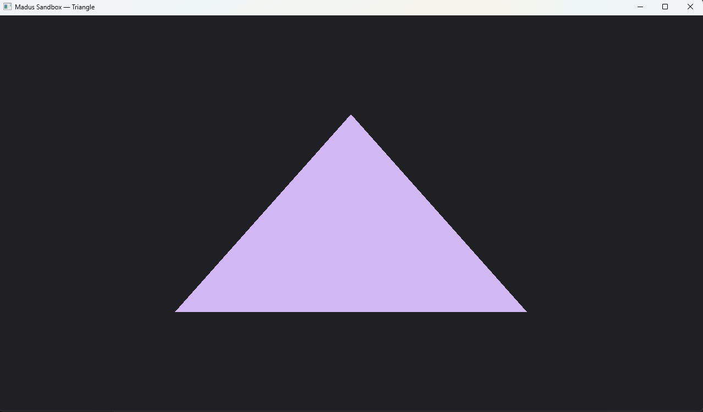

Example output Image

Make sure you have glad and glfw3.4 intalled in vcpkg

install glad using vcpkg
& $env:VCPKG_ROOT\vcpkg.exe install glad:x64-windows     

install glfw using vcpkg
& $env:VCPKG_ROOT\vcpkg.exe install glfw3:x64-windows  

run code through vcpkg using
$env:VCPKG_ROOT="$env:USERPROFILE\vcpkg"; cmake -S . -B build -G "Visual Studio 17 2022" -A x64 -DCMAKE_TOOLCHAIN_FILE="$env:VCPKG_ROOT\scripts\buildsystems\vcpkg.cmake"; cmake --build build --config Debug -j; .\build\Sandbox\Debug\MadusSandbox.exe